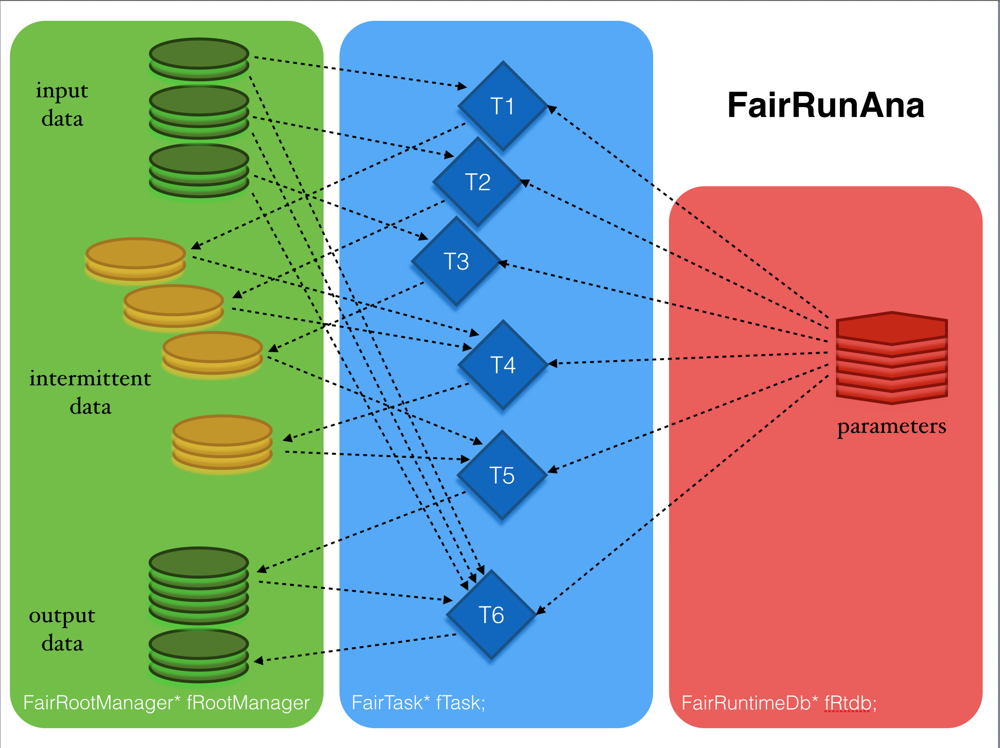

**Author: Radoslaw Karabowicz (r.karabowicz@gsi.de)**

---

**Table of Contents** 

- [Introduction](#user-content-introduction)
- [Data analysis](#user-content-data-analysis)
- [Time based simulation](#user-content-time-based-simulation)
- [Simulation](#user-content-simulation)

---

# Introduction

---

# Data analysis

The FairRunAna class allows data analysis in the FairRoot. 
The input to the FairRunAna class is usually a root file with the tree (named “cbmsim”) that contains events with arrays of data to be analyzed.
The input file is given to FairRoot by function: SetInputFile(TString file0Name). More input files with the same data structure can be added using AddFile(fileNName). 
Files with parallel input data may be added using AddFriend(parallelNName).
The output of the data analysis is typically a root file with the output tree (named “cbmsim”) that contains events with arrays of analysed data.
The process of the data analysis is performed by lists of user defined tasks, that derive from general FairTask. 
Each task works on a specified piece of data and usually produces one array of data. Each task may contain subtask(s). 
The output data from any task may be used by subsequent tasks and/or stored in the output file.
Many (if not all) of the tasks need access to the parameters containers. This access is provided by the member of the FairRunAna, the object of FairRuntimeDb class. 

Few examples of input/output file combination:

* simplest one with one input and one output:

~~~~~~~~~~~~~~~~~~~~~
fRunAna->SetInputFile(“file0”);
fRunAna->SetOutput(“output0”);
~~~~~~~~~~~~~~~~~~~~~

* chain many input files with AddFile(). 
The events will be analysed from one file after another (file1, file2, and so on if more). 
The output file will contain as many events as the sum of events in all input files:

~~~~~~~~~~~~~~~~~~~~~
fRunAna->SetInputFile(“file1”);
fRunAna->AddFile(“file2”);
fRunAna->SetOutput(“output1”);
~~~~~~~~~~~~~~~~~~~~~

* add friends to input file chain. 
Each friend file is checked against the folder structure of the existing friend chains. 
If the structure matches, the friend file is added to the matching friend chain. 
If the structure of the new friend file is not matching any friend chain, another friend chain is created:

~~~~~~~~~~~~~~~~~~~~~
fRunAna->SetInputFile(“file0”);
fRunAna->AddFile(“file1”);
fRunAna->AddFile(“file2”);
fRunAna->AddFriend(“output0”);
fRunAna->AddFriend(“output1”);
fRunAna->SetOutput(“finalOut”);
~~~~~~~~~~~~~~~~~~~~~

* it is possible to analyse all or only some part of the input events with:

~~~~~~~~~~~~~~~~~~~~~
fRunAna->Run(firstEventToAnalyze,lastEventToAnalyze) 
fRunAna->Run(eventNumberToAnalyze);
~~~~~~~~~~~~~~~~~~~~~

but 

~~~~~~~~~~~~~~~~~~~~~
fRunAna->Run(0,0); 
~~~~~~~~~~~~~~~~~~~~~

will analyse all events in input

* if different sources of input has been simulated and have to be analysed together (f.e. background and signal have been generated separately and have to be mixed to obtain realistic results), FairRunAna may RunMixed(). The input is set:

~~~~~~~~~~~~~~~~~~~~~
fRunAna->SetBackgroundFile(“background_a”);
fRunAna->AddBackgroundFile(“background_b”);
fRunAna->SetSignalFile(“signal1_a”,1);
fRunAna->AddSignalFile(“signal1_b”,1);
fRunAna->SetSignalFile(“signal2_a”,2);
fRunAna->AddSignalFile(“signal2_b”,2);
fRunAna->SetOutput(“outputMixed”);
~~~~~~~~~~~~~~~~~~~~~

* when  mixing inputs from different sources, one should use:

~~~~~~~~~~~~~~~~~~~~~
fRunAna->RunMixed(firstEventToAnalyze,lastEventToAnalyze)
~~~~~~~~~~~~~~~~~~~~~

---

# Time based simulation

In order to simulate the constant data stream from the detector, time based simulation concept has been introduced to FairRoot. 
This step is usually performed during digitisation of data from individual detectors. 
It is the responsibility of various detector groups to properly introduce the detector response.
Running of the time based simulation is triggered via functions in FairRunAna. 
One may simulate events’ start times according to Poissonian distribution (with a mean time between events as the parameter) 
or with a constant probability between given minimum and maximum times: 

~~~~~~~~~~~~~~~~~~~~~
fRunAna->SetEventMeanTime(Double_t mean);
fRunAna->SetEventTimeInterval(Double_t min, Double_t max);
~~~~~~~~~~~~~~~~~~~~~

The standard way of running analysis is quite strictly event-based. Data from each event are processed separately and independently from data in other events. The simulation of a continuous data stream requires combining data from different events. It is achieved with the help of individual data handlers that derive from FairWriteoutBuffer.

The standard way of storing data by tasks are to register the output TClonesArrays in the FairRootManager and then to store data in the output TClonesArray for each event. Some of these TClonesArrays (“persistent” ones) are saved after each event to the output tree by FairRunAna.

The tasks designed to run in the time based mode are creating instance of the MyDataWriteoutBuffer in the initialisation stage. The data are added to the MyDataWriteoutBuffer with the StartTime and EndTime.

~~~~~~~~~~~~~~~~~~~~~
fMyDataWriteoutBuffer->FillNewData(MyData,StartTime,EndTime);
~~~~~~~~~~~~~~~~~~~~~

The StartTime and EndTime indicate the time, when the MyData can be influenced by or can influence the later coming data. If such thing happen, i.e. if there will come a new data with StartTime laying between MyData’s StartTime and EndTime, then MyDataWriteoutBuffer::Modify() function will be called. This, very detector-specific function, defines the way the two conflicting data are modified.

Remark: usually any detector has many channels that are working independently. The operator MyData::operator==() is used to check if the data can influence each other.

After each event MyDataWriteoutBuffer is checking the data in the buffer selecting the ones that have EndTime smaller than this EventStartTime. These data that have no chance of being modified any more, will be stored on the disk.

After all events are processed, the rest of the created data are stored in one extra event at the end of the tree.

It is advisable to write a MyDataSorterTask that will sort the objects of MyData in the output array to facilitate the access to the data in the reconstruction stage.

The standard way of getting data inside the task it to request the pointer to the TClonesArray from the FairRootManager instance.

~~~~~~~~~~~~~~~~~~~~~
inputArray = (TClonesArray*) rootManager->GetObject(“MyInputData”);
~~~~~~~~~~~~~~~~~~~~~

When accessing the data obtained in the time based mode one shouldn’t access the data from different events, as the data distribution is chopped by the simulated event structure. The data have to be accessed in realistic time chunks. In FairRoot such data access is enabled using binary functors. Currently two functors are implemented:
*StopTime - returns all the data smaller than the time parameter. It does not return data requested before.
*TimeGap - returns all the data till a gap in the data time stream of a given length.

~~~~~~~~~~~~~~~~~~~~~
BinaryFunctor* fFunctor  = new TimeGap(); // or StopTime();
Double_t       parameter = 20.;           // in nanoseconds
inputArray = (TClonesArray*) rootManager->GetData(“MyInputData”,fFunctor,parameter);
~~~~~~~~~~~~~~~~~~~~~

In the figure the data yield from an example detector is shown as a function of StartTime. The ActiveTime = StopTime-StartTime for this data type is set to 100ns.

Event based digitization. The colour coding in the top panel is representing the simulated MonteCarlo event structure. The vertical lines represent the event start time, while the histogram of the same colour represents digitised data distribution from that event. The events are distributed randomly according to Poissonian distribution with mean time of 50ns. The data for this specific detector is coming about 15ns after the EventStartTime with a width of about 10ns. The detector has data almost in every event. For some events there are data coming even hundreds of nanoseconds after the event start time.

Time based digitization. The middle panel shows the data structure as read directly from the tree with the digitised data (that shouldn’t be done). Different colours represented data stored in different tree entries. The data is often chopped in the middle of the original event’s distribution. It should also be noted that the colour changes (the tree entries boundaries) coincide with the original (EventStartTime-100ns), where the 100ns comes from the detector’s data ActiveTime.

TimeGap(20ns). The bottom panel presents the data retrieved with the BinaryFunctor* fFunctor = new TimeGap(); set to 20ns. The data slices, that the analysis tasks will be working on, are presented in different colours. As requested, these data slices are defined by gaps in the data stream with a length of 20ns or longer. Comparing with the simulated event structure (top panel) one can see, that the time slices do not correspond directly to the original events: quite often they enclose data from several events (like the “green” time slice around t=3600ns composed of data from 7 simulated events) and sometimes the data from one event is distributed over several time slices (like the “red” event around t~3900ns distributed over 2 time slices).

---

# Simulation

The particle transport through the detector model is managed by the FairRunSim class. 
Traditionally, this stage is referred to as “Monte Carlo simulation” or “particle transport”.

The transport engine is operated via the Virtual Monte Carlo (TVirtualMC) of ROOT. Currently Geant3 and Geant4 are supported. They have to be set:

~~~~~~~~~~~~~~~~~~~~~
  FairRunSim *fRun = new FairRunSim();
  fRun->SetName(“TGeant3”); // or “TGeant4”
~~~~~~~~~~~~~~~~~~~~~

The detector description is provided to FairRunSim via experiment-specific classes deriving from FairModule (for passive elements like cave, magnets, pipes, etc.) or from FairDetector (for active detectors). Magnetic field used in the simulations may be set through classes deriving from FairField:

~~~~~~~~~~~~~~~~~~~~~
  fRun->SetMaterials(MediaFile.Data());
  FairModule *Cave= new MyCave("CAVE");
  Cave->SetGeometryFileName("mycave.geo");
  fRun->AddModule(Cave); 
  FairModule *Magnet= new MyMagnet("MAGNET");
  Magnet->SetGeometryFileName("MyMagnet.root");
  fRun->AddModule(Magnet);
  FairDetector *Detector = new MyDetector(“DET”);
  Detector->SetGeometryFileName(“MyDetector.root”);
  fRun->AddModule(Detector);
~~~~~~~~~~~~~~~~~~~~~

Magnetic field used in the simulations may be set through classes deriving from FairField:

~~~~~~~~~~~~~~~~~~~~~
  FairField *fField= new MyField("AUTO");
  fRun->SetField(fField);
~~~~~~~~~~~~~~~~~~~~~

For each simulation run a set of parameters is stored for later reconstruction:

~~~~~~~~~~~~~~~~~~~~~
  FairRuntimeDb *rtdb=fRun->GetRuntimeDb();
  FairParRootFileIo* output=new FairParRootFileIo(kTRUE);
  output->open(ParOutputFile.Data());
  rtdb->setOutput(output);
~~~~~~~~~~~~~~~~~~~~~

These parameters are typically saved in a separate file at the end of the simulation macro: 

~~~~~~~~~~~~~~~~~~~~~
  rtdb->saveOutput();
~~~~~~~~~~~~~~~~~~~~~

The radiation length analysis may be performed after enabling registration of the radiation losses in all of the geometry:

~~~~~~~~~~~~~~~~~~~~~
  fRun->SetRadLenRegister(kTRUE);
~~~~~~~~~~~~~~~~~~~~~

For the visualisation purposes (event display), it is possible to store the information about particle trajectories:

~~~~~~~~~~~~~~~~~~~~~
  fRun->SetStoreTraj(kTRUE);
~~~~~~~~~~~~~~~~~~~~~

The input to the class is provided by the particle generator. 
There are several particle generators implemented in FairRoot, however it is possible to develop additional generators - 
they need to derive from FairGenerator and contain the ReadEvent() function that pushes generated tracks onto the stack. 
One may add several particle generators to FairRunSim. Several generators are part of FairRoot:

* FairParticleGenerator generates a single particle type with given momentum components, vertex and multiplicity per event.
* FairBoxGenerator generates particles within given range over pt, phi, eta, y or theta a fixed multiplicity per event.
* FairIonGenerator for the generation of ions with pre-defined FairIon
* FairAsciiGenerator reads an Ascii input file. The file must contain for each event a header line of the format  NTRACKS  IEV  VX VY VZ, where NTRACKS is the number of tracks in the event, IEV the event number, and VX, VY, VZ the event vertex coordinates in cm. The header line is followed by NTRACKS lines of the format G3PID, PX, PY, PZ, where G3PID is the GEANT3 particle code, and PX, PY, PZ the cartesian momentum coordinates in GeV.
* FairUrqmdGenerator reads the output file 14 (ftn14) from UrQMD. The UrQMD calculation has to be performed in the CM system of the collision; Lorentz transformation into the lab is performed by this class.
* FairPlutoGenerator reads the PLUTO output file (ROOT format) and inserts the tracks into the FairStack via the FairPrimaryGenerator.
* FairPlutoReactionGenerator inserts an inline PReaction and thus connects Pluto with the FairPrimaryGenerator.
* FairShieldGenerator is similar to the FairAsciiGenerator. It uses the ASCII output of the SHIELD code as input for simulation. The format of the event header is: event nr., number of particles, beam momentum, impact parameter; followed by a line for each particle of the format: PID; A; Z; px; py; pz. The PID must be given as for GEANT3. For ions, it is 1000. The total momentum is required, not momentum per nucleon.

---
